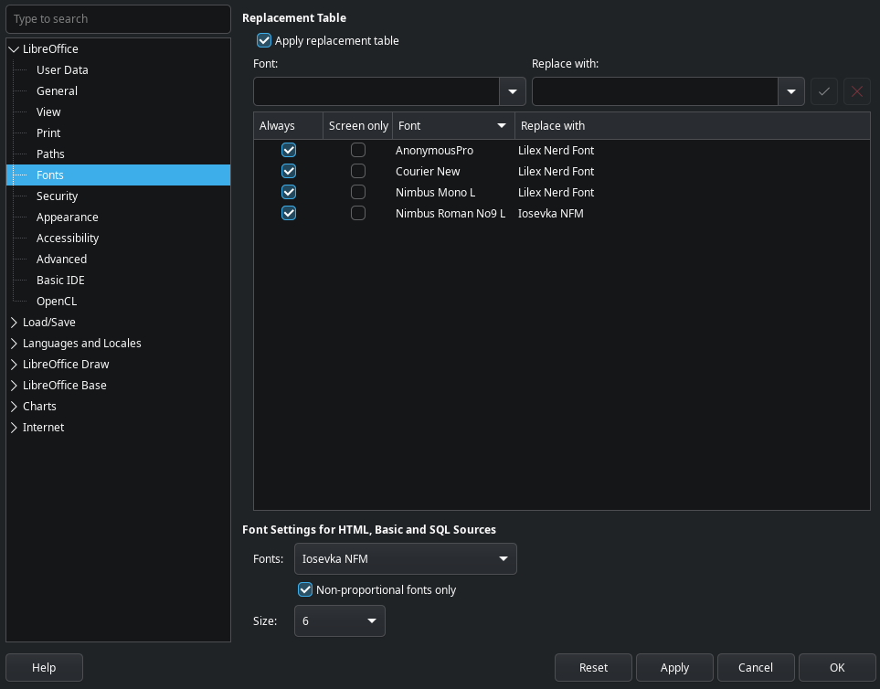
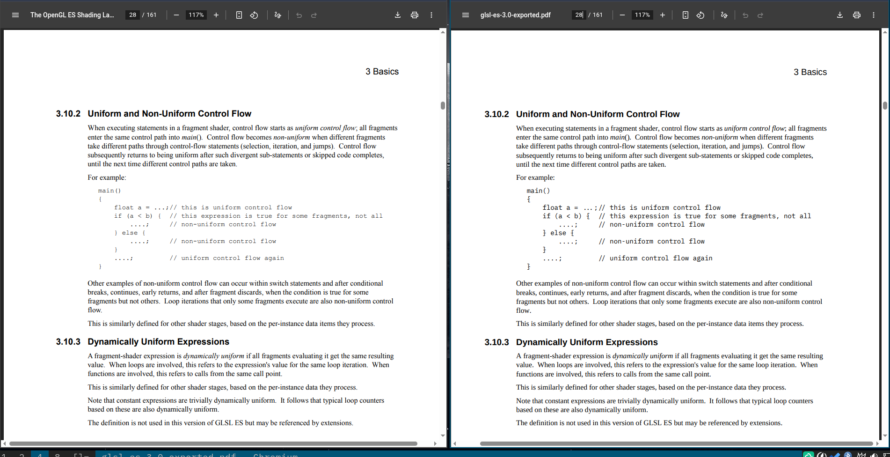
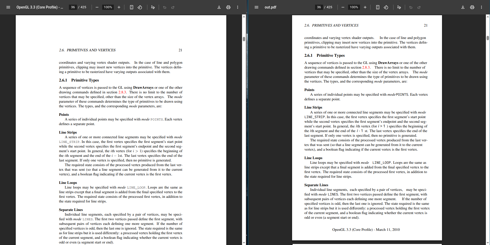

## the last attempt

[last time](/programming/books) when i printed some books, i basically
created images out of the pdf to then crop and put back into a pdf.
this approach worked however it added blur to the final generated pdf.
and there was a font problem where if the book/spec had a very thin
monospace font, i didn't know how to change it. i found a solution to
both of these problems.

## changing monospace font in the pdf

i searched quite a bit, on the archwiki and on forums in general and
i couldn't find some magical command to change a specific font in the
pdf. instead i found that i can edit the pdf with libreoffice-draw and
replace certain fonts with other fonts. this worked quite well.

Steps:

1. open the pdf in libreoffice draw
2. right-click -> page properties -> set the margins to 0
3. switch to the tabbed ui or open the sidebar
4. click on the text-frame with the font to substitute
5. copy the font name from the fonts dropdown list (on sidebar or on nbbar)
6. click on menu `Tools > Options > LibreOffice > Fonts`
7. add the font and it's replacement, select `Always` checkbox, click apply & ok



you might want to adjust the replacement font sizes a bit or it might
be a bit off from the center of the line. as you can see below, the
exported pdf is much more readable & printable.



## reducing the page margins

`pdfcrop` is an amazing tool which can remove the page margins, or set
them to a desired value. i set `25mm` on all sides with the following
command and you can see how much area we saved (effectively zoomed
in).

```bash
pdfcrop --margins '25 25 25 25' in.pdf out.pdf
```



this might not seem like a big difference as these files are still
pdfs, but when they get printed to the paper, the one on the right
will be way more larger than the one on the left as the text is going
to get more area on the page.

i am quite happy with how it turned out, though i have already printed
most of the books/specs i needed :_).
