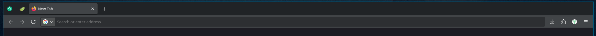

for a long time i have struggled with chat applications. as a remote
developer, chat is the only means of communication other than some
scheduled calls. and so i had to keep these chat applications running
in the background. if i turned on notifications on these applications
then they would just show every message sent, so that wasn't an option.

often i closed these applications when i wanted some focus time but
then there was a part of my brain wondering about "what if someone
pings me about something".

finally i found a nice solution to the problem. i just pin tabs on
the browser and that puts them out of the way. and if someone pings
me, the pinned tabs show a dot telling me it's time to check the chat.

