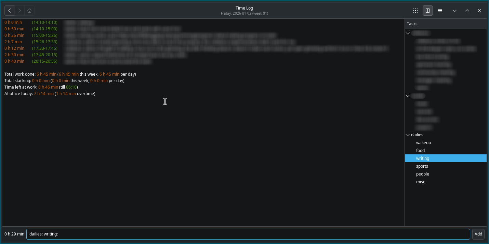

building habbits is not an easy task, they require change and change
creates friction. but not all changes have to create friction and
systems are ways to slip in changes into your routine in a way that
the resulting friction doesn't cause bruses.

for example, i have some gym equipment at home and i tried doing some
exercises myself but i couldn't do it regularly because it was just
too boring doing it alone. so i joined a badminton academy. i just
have to go there and rest happens on it's own, some days it's matches,
which is fun, and some days it's a lot of running and training, which
is less fun, but with people around, it's doable with some chats and
smiles and screems :).

i have a few rivals now, so i am careful about what i eat at home as i
want to build a good physique to match thier level, i jump ropes when
i am waiting for my turn on the court. one good system can create a
lot of positive feedback loops. i haven't stated the other benifits of
sports.

another system i built recently was that of timelogging. previously i
used gtimelog to track the time spent on work tasks, but now i log my
activities as well to see where the day went exactly. i am not micro
managing anything but i am now conscious about where i spend the next
30m or 1h. time is the only constant you can't change :).

Systems like these, paired with the ability to make steady [progress],
allow you to get the maximum value from your time.

[progress]: /programming/progress/
