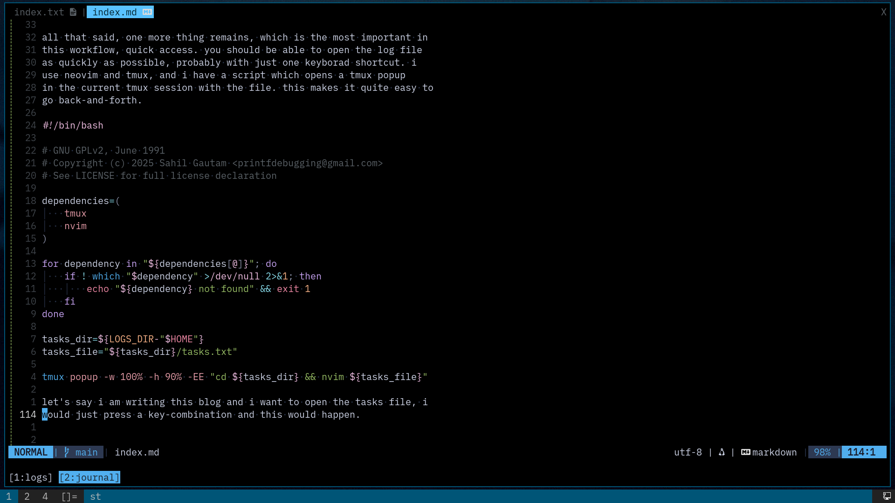
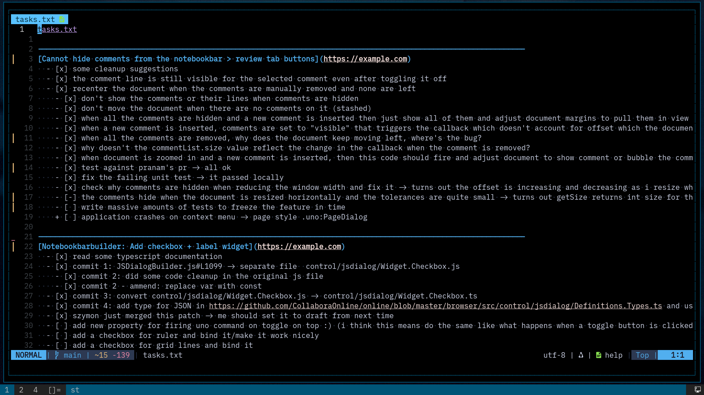

often we are working on multple tasks at a time and we switch between
them, ask for a code review on one task and continue working on the
other. in all this to-and-fro, it's easy to forget about some task
assigned to you, or some PR which still hasn't been reviewed.

one can go over all the mails and lists to stay aware of what's going
on and what's important, but i say there's a better way, one which
scales quite well even for large number of tasks. the idea is to have
one log file and in that have a section for each task with a rough
checklist of things which has been done and things which are in the
pipeline. very high priority tasks are at the top of the log file
while the less important ones are on the bottom side.

you can either use markdown or some other file format for it, i use
vim's help format. whenever i commit something, or get a mail, or
chat with mentors about the task (and get some pointers), i either
cross-out some item from the list, or i add a new item to the list.
the idea is to keep this file updated with various developments.

so let's say i am done with the first task and i asked gokay to review
it. i will add that entry to the list and then move this whole task to
the second position as then the priorities suggest that i work on the
second task till i get a review on this one.

```help
---------------------------------------------------------------------------------------------------------------
[Cannot hide comments from the notebookbar > review tab buttons](https://example.com)
  - [x] some cleanup suggestions
  - [x] the comment line is still visible for the selected comment even after toggling it off
  - [x] recenter the document when the comments are manually removed and none are left
    - [x] don't show the comments or their lines when comments are hidden
    - [x] don't move the document when there are no comments on it (stashed)
    - [x] when all the comments are hidden and a new comment is inserted then just show all of them and adjust document margins to pull them in view
    - [x] when a new comment is inserted, comments are set to "visible" that triggers the callback which doesn't account for offset which the document is already at, and thus keeps moving the document as we insert comments, fix this
    - [x] when all the comments are removed, why does the document keep moving left, where's the bug?
    - [x] why doesn't the commentList.size value reflect the change in the callback when the comment is removed?
    - [x] when document is zoomed in and a new comment is inserted, then this code should fire and adjust document to show comment or bubble the comment, currently it's just half visible.
    - [x] test against pranam's pr -> all ok
    - [x] fix the failing unit test -> it passed locally
    - [x] check why comments are hidden when reducing the window width and fix it -> turns out the offset is increasing and decreasing as i resize why?. -> serious logical error
    - [-] the comments hide when the document is resized horizontally and the tolerances are quite small -> turns out getSize returns int size for the map
    - [ ] write massive amounts of tests to freeze the feature in time
    + [ ] application crashes on context menu -> page style .uno:PageDialog

---------------------------------------------------------------------------------------------------------------
[Notebookbarbuilder: Add checkbox + label widget](https://example.com)
  - [x] read some typescript documentation
  - [x] commit 1: JSDialogBuilder.js#L1099 -> separate file  control/jsdialog/Widget.Checkbox.js
    - [x] commit 2: did some code cleanup in the original js file
    - [x] commit 2 - ammend: replace var with const
  - [x] commit 3: convert control/jsdialog/Widget.Checkbox.js -> control/jsdialog/Widget.Checkbox.ts
  - [x] commit 4: add type for JSON in https://github.com/CollaboraOnline/online/blob/master/browser/src/control/jsdialog/Definitions.Types.ts and use in widget
  - [x] szymon just merged this patch -> me should set it to draft from next time
  - [ ] add new property for firing uno command on toggle on top :) (i think this means do the same like what happens when a toggle button is clicked which then fires a command)
  - [ ] add a checkbox for ruler and bind it/make it work nicely
  - [ ] add a checkbox for grid lines and bind it
  - [ ] add a checkbox for another control (check if there are more which need this) ???
  - [ ] look out for corner/edge cases like various places where we return if it's a radiobutton or checkbox

---------------------------------------------------------------------------------------------------------------
[Style preview: Add button that expands container (GH#12171)](https://example.com)
  - [ ] read and figure out the suggestions
  - [ ] szymon said that there are some pointers

---------------------------------------------------------------------------------------------------------------
[Design Bits : Cursor does not change when hovering or resizing the handles of an object](https://example.com)
  - [ ] fix the regression nicely
  - [ ] write a test for the regression fix

---------------------------------------------------------------------------------------------------------------
[GH#12177 Refactor and Split COOLWSD.cpp into Logical Modules](https://github.com/CollaboraOnline/online/issues/12177)
  - [x] pushed the first dumpWsd refactor, thanks ash and mst
  - [ ] now separate out PrisonerRequestDispatcher
...
```

all that said, one more thing remains, which is the most important in
this workflow, quick access. you should be able to open the log file
as quickly as possible, probably with just one keyborad shortcut. i
use neovim and tmux, and i have a script which opens a tmux popup
in the current tmux session with the file. this makes it quite easy to
go back-and-forth.

```bash
#!/bin/bash

# GNU GPLv2, June 1991
# Copyright (c) 2025 Sahil Gautam <printfdebugging@gmail.com>
# See LICENSE for full license declaration

dependencies=(
    tmux
    nvim
)

for dependency in "${dependencies[@]}"; do
    if ! which "$dependency" >/dev/null 2>&1; then
        echo "${dependency} not found" && exit 1
    fi
done

tasks_dir=${LOGS_DIR-"$HOME"}
tasks_file="${tasks_dir}/tasks.txt"

tmux popup -w 100% -h 90% -EE "cd ${tasks_dir} && nvim ${tasks_file}"
```

let's say i am writing this blog and i want to open the tasks file, i
would just press a key-combination and this would happen. in the
second screenshot, a popup covers the terminal window and we have the
tasks file opened in it. now we can quickly edit, or quickly take a look
at what we are working on and what's next.






