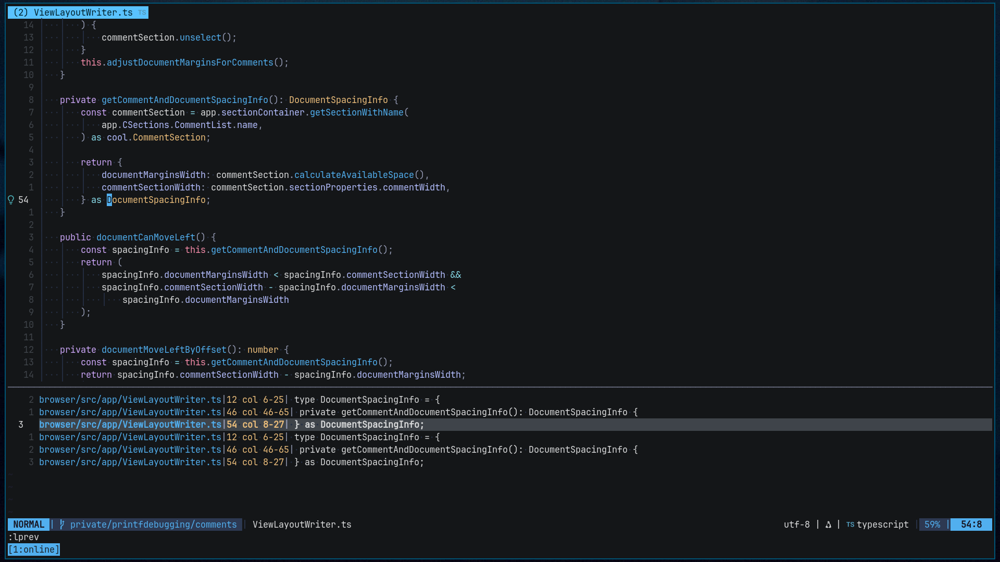
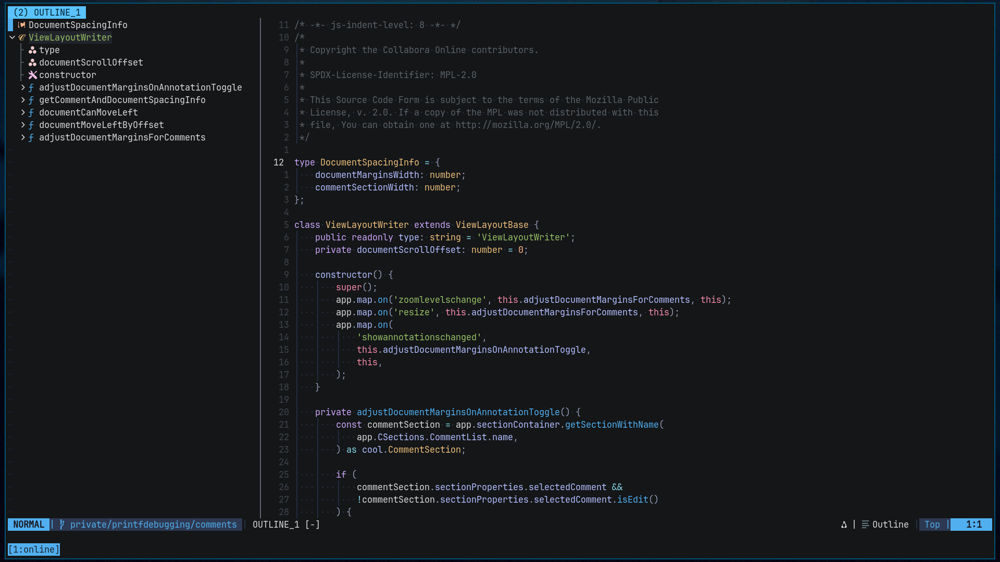

editor is a window through which the programmer looks into the world
of computers. if that window is small and translucent or very big and
transparent affects how you see the world beyond it. does the window
ask you to sit at a certain position at a certain distance to get the
best view, or does it get out of your way as soon as you start looking
through it?

neovim is a great editor, it gets out of my way as soon as i start
using it, the muscle memory kicks in and i navigate through the code
effortlessly. neovim's `loclist`s lets me get a list of references for
a variable and i can travel through that list with `M-n` and `M-p`.
then if i want to preserve this list and do the same for some other
variable i found while investigating, i can do that because loclists
are window local to a tab/window.

another interesting feature is outline. instead of scrolling through
the file and reading it to find something, i can just search in the
outline and get an idea of what's available in the file/module. this
makes life so much easier.

