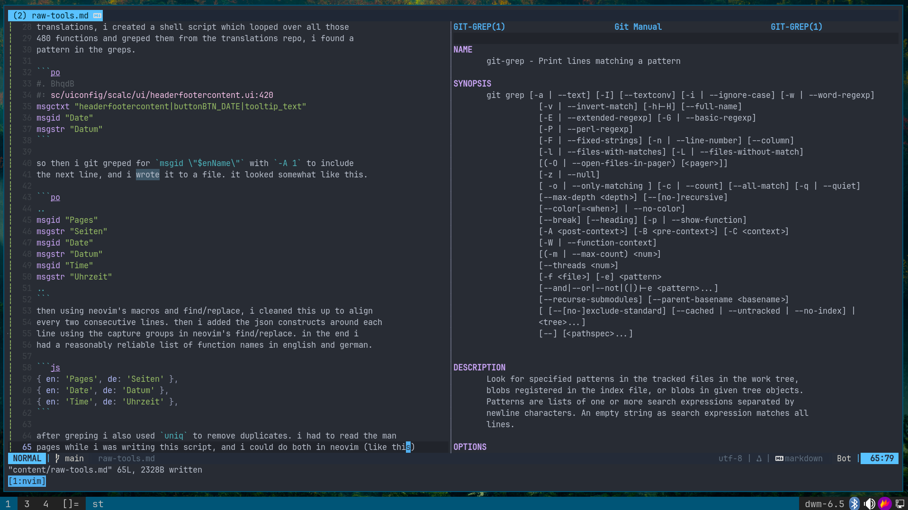

i still think clicky-cliks like vscode have a point, i recently setup
an opengl [project] and vscode made it possible for me to forget
about the build system and the debugger, and just focus on code. i
can clone the project on windows or linux, open it in vscode and the
extensions will be automatically installed, the workspace settings
will be applied.. see `.vscode/`.

[project]: https://codeberg.org/printfdebugging/learnopengl

but beyond that "cross platform, shared config, just code" usecase,
clicky-cliks are pretty limited. i was assigned a task to add german
translations of calc functions to online notebookbar. had i been a
vscode only person, the only approaches i could have thought of would
have been "do it manually for all 480 functions, one at a time", or
"ask copilot/llm to do it for me".

the llm's output is quite unreliable, not something which you can just
push (if you are responsible) and if i had to then verify each one,
what's the point of using an allm in the first place.

i had a list of english functions which i previously got by printing
them from a running libreoffice (as it loaded them). to get the german
translations, i created a shell script which looped over all those
480 functions and greped them from the translations repo, i found a
pattern in the greps.

```po
#. BhqdB
#: sc/uiconfig/scalc/ui/headerfootercontent.ui:420
msgctxt "headerfootercontent|buttonBTN_DATE|tooltip_text"
msgid "Date"
msgstr "Datum"
```

so then i git greped for `msgid \"$enName\"` with `-A 1` to include
the next line, and i wrote it to a file. it looked somewhat like this.

```po
..
msgid "Pages"
msgstr "Seiten"
msgid "Date"
msgstr "Datum"
msgid "Time"
msgstr "Uhrzeit"
..
```
then using neovim's macros and find/replace, i cleaned this up to align
every two consecutive lines. then i added the json constructs around each
line using the capture groups in neovim's find/replace. in the end i
had a reasonably reliable list of function names in english and german.

```js
{ en: 'Pages', de: 'Seiten' },
{ en: 'Date', de: 'Datum' },
{ en: 'Time', de: 'Uhrzeit' },
```

after greping i also used `uniq` to remove duplicates. i had to read
the man pages while i was writing this script, and i could do both in
neovim (like this). this is why i think cli tools like neovim are far
superior to tools like vscode.



clicky-cliks are still needed as cli tools are sometimes not supported
on all the platforms, neovim and it's clangd don't work that well with
libreoffice on windows, half of the editor is filled with red error
markers and goto-definitions are unreliable. so in those cases, a well
configured vscode might work better. it's important to develop muscle
memory with these raw tools so that whenever you find some non-trivial
task, you can use them and save some time and frustration.
